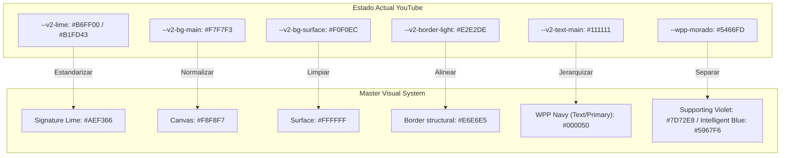
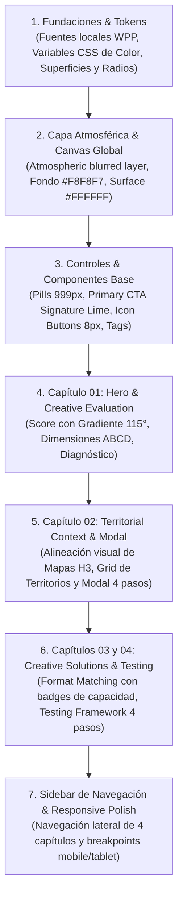

# FASE 4B — VISUAL GAP AUDIT · CI YOUTUBE
**Auditoría Visual y Técnica del Estado Actual vs. Master Visual System**

---

## 01. EXECUTIVE SUMMARY

El presente documento constituye la **auditoría visual y técnica exhaustiva** del estado actual de **Creative Intelligence for YouTube (CI YouTube)** frente al **Master Visual System transversal de Creative Intelligence**.

### Principios Rectores de la Auditoría
1. **Frontera Arquitectónica Clara:**
   - **Master Visual System** = Lenguaje visual transversal (tipografía WPP, paleta cromática, superficies sin sombras innecesarias, radios estandarizados, gradiente de score, atmósfera de fondo y controles semánticos).
   - **Arquitectura Funcional CI YouTube** = Inmutable e independiente de Social:
     $$\text{HERO} \longrightarrow \mathbf{01. \text{ CREATIVE EVALUATION \& INTERPRETATION}} \longrightarrow \mathbf{02. \text{ TERRITORIAL CONTEXT \& CREATIVE OPPORTUNITIES}} \longrightarrow \mathbf{03. \text{ CREATIVE SOLUTIONS}} \longrightarrow \mathbf{04. \text{ TESTING FRAMEWORK}}$$
2. **Cero Modificación de Código en Fase 4B:** Esta fase es estrictamente diagnóstica y documental; no se ha modificado ningún archivo de código, componente, estilo ni asset operativo.

### Resumen del Diagnóstico
- **Tipografía:** Actualmente depende de `@font-face` remotos alojados en CDN externo (`cdn.nexus-creative-solutions.com`) con definiciones fragmentadas de familias (`WPP Regular`, `WPP Medium`, `WPP Black`, `WPP Thin`) y un error de vinculación (`WPP Black` apunta al binario `WPP-Medium.woff2`). Requiere migración a tipografía local WPP con 5 pesos operativos bajo una única familia `font-family: 'WPP'` y fallback de sistema.
- **Color:** Coexisten múltiples paletas históricas (tokens V1 legacy `#000050`, `#aef366`, `#5466fd`, tokens V2 `#B6FF00`, `#F7F7F3`, `#080A09`, y estilos hardcodeados de Material). Falta unificación con los tokens oficiales: WPP Navy (`#000050`), Intelligent Blue (`#5967F6`), Signature Lime (`#AEF366`), Supporting Violet (`#7D72E8`), Canvas (`#F8F8F7`), Surface (`#FFFFFF`), Border (`#E6E6E5`).
- **Surfaces & Shadows:** Múltiples cards y paneles emplean `box-shadow` pesados y fondos arbitrarios. Debe aplicarse el principio rector *"Surface contrast first. Border second. Shadow last."*
- **Score & Atmósfera:** El score visual actual es un círculo SVG con borde unicolor (`#B6FF00`), careciendo del gradiente angular oficial de 115°. No existe capa atmosférica global detrás de la aplicación.

---

## 02. CURRENT VISUAL STATE

El estado visual actual de CI YouTube es el resultado de sucesivas iteraciones sobre una base inicial de Google Cloud / Angular Material, a la cual se sobrepusieron reglas V2:

```
[ Capa Base: Angular Material Theming (Indigo/Pink & Roboto/Material Icons) ]
                         ↓
[ Capa V1 Legacy: Paleta CSS parcial (--wpp-azul, --wpp-verde, etc.) ]
                         ↓
[ Capa V2: Tokens específicos (--v2-lime #B6FF00, --v2-bg-main, theme oscuro en modales) ]
                         ↓
[ Capa Inline: Estilos directos en plantillas (app.component.html: style="background:...") ]
```

### Principales Inconsistencias Detectadas:
1. **Divergencia de Lima:** Se utiliza `#B6FF00` (verde neón saturado) y `#B1FD43` en botones de Angular Material, en lugar del tono aprobado **Signature Lime `#AEF366`**.
2. **Doble Tema Descoordinado:** El reporte vive en un fondo claro (`#F7F7F3`), mientras que el visor territorial y el modal de territorio fuerzan un fondo oscuro profundo (`#080A09` / `#111513`), generando saltos de contraste visual abruptos sin una relación atmosférica común.
3. **Fragmentación de Radios y Sombras:** Coexisten 17 valores diferentes de `border-radius` (desde 1px hasta 999px) y más de 25 variaciones de `box-shadow` e `inset shadow`.

---

## 03. TYPOGRAPHY

### Diagnóstico Técnico Actual

| Aspecto | Implementación Actual en YouTube | Master Visual System Esperado | Gap Identificado |
|---|---|---|---|
| **Origen de fuentes** | CDN remoto: `https://cdn.nexus-creative-solutions.com/...` | Archivos locales WOFF2 en `assets/fonts/` | Dependencia externa sensible a conectividad de CDN. |
| **Familias declaradas** | 4 familias separadas: `'WPP Black'`, `'WPP Medium'`, `'WPP Regular'`, `'WPP Thin'` | 1 única familia: `font-family: 'WPP'` con pesos estándar | Multiplicidad de nombres que obliga a cambiar `font-family` en lugar de `font-weight`. |
| **Pesos disponibles** | 100 (Thin), 400 (Regular), 500 (Medium), 900 (Black pero vinculado erróneamente a Medium) | 5 pesos operativos: **300 Light, 400 Regular, 500 Medium, 700 Bold, 900 Black** (100 Thin excluido de UI operativa) | Falta peso 300 y 700 nativos; 900 está roto en CDN. |
| **Fallback** | `'Inter', 'Helvetica Neue', Arial, sans-serif` | Fallback de sistema homogéneo: `system-ui, -apple-system, 'Segoe UI', Roboto, sans-serif` | Coexisten mezclas con Roboto inyectado por `index.html`. |
| **Aplicación** | Clases dispersas (`.v2-h1`, `.v2-h2`, `.ca-title`, `input { font-family: 'WPP Thin' !important }`) | Jerarquía tipográfica normalizada (Display, H1, H2, H3, Body Large, Body, Caption). | Inputs forzados a peso 100 ilegible. |

---

## 04. COLOR SYSTEM

### Mapeo de Tokens Cromáticos



### Reglas Semánticas vs. Datos
- **Conflicto Actual:** Se utilizan grises y negros estructurales (`#202124`, `#64748B`, `#1E293B`) mezclados en chips y series de datos, o verdes neón mezclados con verdes de éxito (`#22c55e`, `#16A34A`, `#2E7D32`).
- **Regla Master:**
  - **Estructural / Texto:** Negro, gris y Canvas/Surface (`#000050`, `#5F5F5F`, `#F8F8F7`, `#FFFFFF`, `#E6E6E5`).
  - **Datos / Series:** Paleta cromática activa (Intelligent Blue `#5967F6`, Supporting Violet `#7D72E8`, Signature Lime `#AEF366`, Amber `#F59E0B`, Coral/Pink `#EC4899`).

---

## 05. SURFACES, CARDS & SHADOWS

### Principio: *"Surface contrast first. Border second. Shadow last."*

1. **Canvas y Superficie:**
   - *Actual:* El fondo global utiliza `--v2-bg-main: #F7F7F3` y las tarjetas usan una mezcla de `#FFFFFF`, `#F0F0EC` o fondos oscuros `#111513`.
   - *Master:* **Canvas `#F8F8F7`** con **Superficies / Cards en `#FFFFFF`** y borde de 1px `#E6E6E5`.
2. **Eliminación de Sombras en Cards Planas:**
   - *Actual:* Múltiples clases (.mat-mdc-card, .mat-expansion-panel, .v2-card-light, .v2-lectura-card) aplican `box-shadow: 0 4px 24px rgba(32, 33, 36, 0.12)`, `0 2px 12px rgba(...)`, etc.
   - *Master:* **0px box-shadow** en todas las tarjetas estándar del reporte.
3. **Uso Exclusivo de Sombras en Elementos Flotantes:**
   - Sombras reservadas estrictamente para: Modal de Territorios, Dropdowns de selección, Tooltips y Menús contextuales flotantes (`box-shadow: 0 20px 40px -8px rgba(0, 0, 80, 0.12)`).

---

## 06. CONTROLS

### Diagnóstico de Controles de Interfaz

| Control | Estado Actual en YouTube | Master Visual System Esperado | Gap & Adaptación |
|---|---|---|---|
| **Primary CTA** | `.mat-mdc-raised-button.mat-primary` (radio 12px, fondo `#B1FD43`, sombra pesada verde) | **Pill / Rounded-Full (`999px`)**, fondo **Signature Lime `#AEF366`**, texto **WPP Navy `#000050`**, sin sombra de color. | Reducir altura a 44–48px, forma píldora completa, tipografía WPP Medium/Bold. |
| **Secondary Button** | `.btn-secondary` (radio 999px, borde 1px gris) | **Pill / Rounded-Full (`999px`)**, fondo transparente, borde 1px `#E6E6E5` o `#00005020`, texto `#000050`. | Ajustar tokens de color y hover sutil. |
| **Icon Buttons** | `.mat-mdc-icon-button` (radio 50% circular, tamaño 40px) | **Rounded 8px**, contenedor de 36x36px o 40x40px, fondo sutil `rgba(0,0,80,0.04)`. | Homogeneizar iconos a contenedor cuadrangular con radio 8px. |
| **Inputs & Selects** | Material Outlined inputs (radio 4px/8px, outline material grueso) | **Rounded 8px**, fondo `#FFFFFF`, borde 1px `#E6E6E5`, texto `#000050`, altura 44px. | Eliminar font-weight 100 de inputs; adoptar estilo limpio. |
| **Tags / Status Badges** | Mix de radios (4px, 6px, 12px, 20px) y colores variados | **Rounded-Full (`999px`)**, padding `4px 12px`, tipografía 11–12px WPP Medium, texto semántico. | Reemplazar badges rectangulares por píldoras continuas. |

---

## 07. RADIUS SYSTEM

### Normalización de Radios de Borde

En `app.component.css` se detectaron **17 radios arbitrarios**. La auditoría propone consolidar este esquema en 4 niveles formales:

```
┌──────────────────────────────┬──────────────────┬────────────────────────────────────────────────────────┐
│ Nivel del Sistema            │ Radio Master     │ Usos Asignados en CI YouTube                           │
├──────────────────────────────┼──────────────────┼────────────────────────────────────────────────────────┤
│ 1. Controls & Small Elements │ 8px              │ Inputs, Selects, Icon Buttons, Tooltips, Thumbnails    │
│ 2. Standard Cards            │ 16px – 20px      │ Evaluation Card, ABCD Dimension Cards, Format Cards    │
│ 3. Modals & Large Surfaces   │ 24px             │ Modal de Territorios, Dark Map Wrapper, Dialogs        │
│ 4. Pills & Circulars         │ 999px / 50%      │ Primary CTA, Badges, Status Tags, Score Circle         │
└──────────────────────────────┴──────────────────┴────────────────────────────────────────────────────────┘
```

---

## 08. SIDEBAR & NAVIGATION

### Diagnóstico de Navegación
- **Estado Actual:**
  - `ci-nav-rail` flotante mínimo en el costado izquierdo con 3 botones de acción (`Análisis`, `Reporte`, `Descargar`).
  - El Reporte se presenta como una página continua sin índice de navegación lateral o barra de navegación que indique el avance entre los 4 capítulos aprobados.
- **Concepto Master Adaptado a YouTube:**
  - Conservar el concepto visual de **Sidebar de Navegación** estructurado en las **4 fases de YouTube**:
    1. `01` Creative Evaluation & Interpretation
    2. `02` Territorial Context & Creative Opportunities
    3. `03` Creative Solutions (Format Matching & Creative Services)
    4. `04` Testing Framework
  - Proporcionar indicadores de estado activo (`active state` con barra/indicador Signature Lime o Intelligent Blue) y scrollspy automático para navegación de lectura ejecutiva fluida.

---

## 09. SCORE & SCORE GRADIENT

### Diagnóstico del Creative Score

- **Estado Actual:**
  - Componente: SVG circular con `stroke: var(--v2-lime)` (`#B6FF00`), rotado -90°, con fondo de stroke gris claro.
  - El score es monocromático e hiper-brillante.
- **Master Visual System Aprobado:**
  - Gradiente angular de firma:
    $$\text{linear-gradient}(115^\circ, \text{\#E7FFB8 } 0\%, \text{\#AEF366 } 30\%, \text{\#9CE8C8 } 62\%, \text{\#C8B8FF } 100\%)$$
  - En SVG: definición de `<defs><linearGradient id="scoreGrad" x1="0%" y1="0%" x2="100%" y2="100%">...</linearGradient></defs>` aplicado al `stroke` o al relleno numérico.
  - Tipografía numérica central en **WPP Black (`#000050`)**, eliminando la saturación excesiva del verde neón.

---

## 10. ATMOSPHERIC BACKGROUND

### Diagnóstico de Capa Ambiental Global

- **Estado Actual:**
  - La aplicación tiene un fondo plano `#F7F7F3` en el body.
  - En el primer paso (wizard de configuración) existen unos blobs locales aislados (`.ciw-blob`), pero no existe una capa atmosférica transversal y cohesiva detrás de todo el reporte.
- **Master Visual System Aprobado:**
  - Capa fija/absoluta detrás del contenido principal:
    ```
    BODY (Fondo Base #F8F8F7)
      └── .ci-atmospheric-layer (pointer-events: none, z-index: 0, overflow: hidden)
            ├── Blob 1: Lime Soft (#AEF36630), Top-Left, blur(180px)
            ├── Blob 2: Intelligent Blue (#5967F615), Center-Right, blur(200px)
            └── Blob 3: Supporting Violet (#7D72E818), Bottom-Left, blur(190px)
      └── CONTENIDO DEL REPORTE (z-index: 1, relative)
    ```
  - **Regla:** Intensidad extremadamente suave (< 15–20% opacidad) para que jamás compita con el texto ni la legibilidad de los datos.

---

## 11. DATA VISUALIZATION

### Diagnóstico de Gráficos y Barras de Datos

1. **Barras ABCD (Atención, Branding, Conexión, Dirección):**
   - *Actual:*
     - Atención: `#22c55e` (verde estándar)
     - Branding: `#f97316` (naranja)
     - Conexión: `#ec4899` (rosa fucsia)
     - Dirección: `#f59e0b` (ámbar)
   - *Master:* Mantener la diferenciación dimensional pero integrarla a los pesos y tonos armónicos del Master System (fondos de barra en `rgba(..., 0.08)`, alturas de barra estandarizadas a 6–8px con radio 999px).
2. **Visor Cartográfico (Deck.GL / H3 Hexágonos):**
   - El contenedor `#map-container` debe integrarse con esquinas redondeadas de 24px, borde estructural `#E6E6E5` y controles de leyenda limpios.

---

## 12. COMPOSITION & EDITORIAL RHYTHM

### Ritmo Visual y Espaciado

```
[ HERO: Encabezado Editorial + Thumbnail + Metadatos de Campaña (Grid 2 columnas) ]
                                    ↓ (gap: 48px)
[ 01. EVALUATION: Score Circular 115° + 4 Cards ABCD + Diagnóstico Ejecutivo ]
                                    ↓ (gap: 64px)
[ 02. TERRITORIAL CONTEXT: Resumen + Escenas + Dark Map H3 + Grid Oportunidades ]
                                    ↓ (gap: 64px)
[ 03. CREATIVE SOLUTIONS: Format Matching (4 Cards con Badges de Capacidad) ]
                                    ↓ (gap: 64px)
[ 04. TESTING FRAMEWORK: 4 Step-Cards (CREATE → TEST → MEASURE → LEARN) ]
```

- **Ancho máximo de lectura:** Contenedor central acotado a `1280px` – `1360px` centrado con padding lateral de `32px` – `48px`.
- **Jerarquía Editorial:** Kicker superior en mayúsculas (`font-size: 11px`, `letter-spacing: 1.5px`, color `#5967F6` o `#5F5F5F`), título H2 de 32–36px en WPP Black, subtítulo de 15px en WPP Regular (`#5F5F5F`).

---

## 13. RESPONSIVE BREAKPOINTS

### Matriz de Adaptabilidad

| Dispositivo | Ancho de Pantalla | Comportamiento del Reporte |
|---|---|---|
| **Desktop Ultra/Wide** | $\ge 1440\text{px}$ | Sidebar de navegación fija a la izquierda (240px); contenido en grid central de 1280px; ABCD en grid 4 columnas; Territorios en grid 3 columnas. |
| **Laptop / Desktop** | $1024\text{px} - 1439\text{px}$ | Sidebar colapsable o compacta (64px); ABCD en grid 2x2; Territorios en grid 2 columnas; Modal de territorio con split vertical balanceado. |
| **Tablet** | $768\text{px} - 1023\text{px}$ | Sidebar superior o drawer oculto; Hero en stack vertical; ABCD en 2 columnas; Testing framework en scroll horizontal. |
| **Mobile** | $< 768\text{px}$ | Todo en stack vertical a 1 columna; padding reducido a 16px; mapas y cards adaptadas al 100% del ancho. |

---

## 14. SOCIAL-SPECIFIC EXCLUSIONS

Los siguientes componentes y conceptos pertenecen exclusivamente a **Creative Intelligence for Social** y **NO** deben trasladarse a CI YouTube:

- ❌ Métricas de redes sociales: *Hook Rate*, *Hold Rate*, *Fatigue Score*, *Average Watch Time de Reels*.
- ❌ Formatos nativos de Social: *Feed 1:1 / 4:5*, *Stories 9:16*, *TikTok In-Feed*, *Reels Video Templates*.
- ❌ Módulos de Social: *Hook Analysis Timeline*, *Creator Fatigue Matrix*, *Organic vs Paid Social comparison*.
- ❌ Nomenclatura o jerarquía de 5 capítulos propia de Social (*Capítulo 01 Performance, Capítulo 02 Hook, etc.*).
- ❌ Dimensionamiento vertical 9:16 como layout predeterminado de los reproductores (YouTube utiliza principalmente 16:9 y relaciones de aspecto de TV conectada).

---

## 15. GAP MATRIX

| Elemento | Estado Actual YouTube | Master Esperado | Nivel de Gap | Acción Futura Recomendada |
|---|---|---|:---:|---|
| **Typography** | CDN remoto, 4 nombres de fuente, `WPP Black` erróneo | WOFF2 locales en `assets/fonts/`, familia única `font-family: 'WPP'`, 5 pesos (300, 400, 500, 700, 900) | **ALTO** | Incorporar WOFF2 locales en proyecto y definir `@font-face` canónico en `styles.css`. |
| **Fallback Font** | Mezcla de Inter, Roboto y sans-serif | `system-ui, -apple-system, 'Segoe UI', Roboto, sans-serif` | **MEDIO** | Normalizar la pila de fuentes de respaldo en `:root`. |
| **Color Palette** | Mezcla de `#B6FF00`, `#B1FD43`, `#202124`, `#5466FD` | `#000050` (Navy), `#5967F6` (Blue), `#AEF366` (Lime), `#7D72E8` (Violet), `#F8F8F7` (Canvas), `#FFFFFF` (Surface), `#E6E6E5` (Border) | **ALTO** | Reescribir variables CSS en `:root` adoptando la paleta Master. |
| **Surfaces & Cards** | Cards con `box-shadow` pesados y fondos `#F0F0EC` / `#FFFFFF` | Fondo `#FFFFFF` plano sobre Canvas `#F8F8F7`, borde 1px `#E6E6E5`, 0px shadow | **ALTO** | Eliminar sombras de tarjetas y establecer borde estructural neutro. |
| **Radius System** | 17 valores dispersos (1px..999px) | Sistema estandarizado: 8px (controles), 16–20px (cards), 24px (modales), 999px (pills) | **MEDIO** | Mapear selectores CSS a las 4 variables de radio. |
| **Buttons & CTAs** | Botones Material rectangulares con sombra verde fuerte | Primary CTA en **Pill (`999px`)**, Signature Lime `#AEF366`, texto `#000050` | **ALTO** | Actualizar `.mat-mdc-raised-button.mat-primary` y clases de botones globales. |
| **Pills & Status** | Rectángulos con radios de 4px–6px | Píldoras completas (`999px`), padding `4px 12px`, texto en WPP Medium | **MEDIO** | Normalizar badges de taxonomía y etiquetas de estado. |
| **Sidebar / Nav** | Rail mínimo de 3 iconos sin índice de reporte | Barra lateral/sticky de navegación estructurada en los 4 capítulos aprobados | **MEDIO** | Implementar componente de navegación lateral para el reporte de 4 secciones. |
| **Score Visual** | Círculo SVG unicolor verde neón `#B6FF00` | Círculo SVG con gradiente angular 115° (`#E7FFB8` $\to$ `#AEF366` $\to$ `#9CE8C8` $\to$ `#C8B8FF`) | **ALTO** | Integrar definición de gradiente angular en el SVG del Creative Score. |
| **Atmospheric Bg** | Fondo plano `#F7F7F3` sin atmósfera global | Capa ambiental `.ci-atmospheric-layer` con 3 blobs desenfocados (160–200px blur) | **ALTO** | Añadir capa ambiental global detrás del body/viewport. |
| **Data Viz** | Colores estructurales mezclados con datos | Separación estricta: gris/negro = estructura; color = métricas y señales | **MEDIO** | Ajustar colores de indicadores, gráficos y barras ABCD. |
| **Spacing & Grid** | Espaciados variables (margin-top-8, 16, 24, padding inline) | Escala modular coherente: 8, 16, 24, 32, 48, 64px; ancho máximo 1280–1360px | **MEDIO** | Normalizar espaciados entre secciones y contenedores editoriales. |
| **Responsive** | Pocas media queries puntuales en el CSS | Breakpoints completos (Desktop 1440+, Laptop 1024, Tablet 768, Mobile <768) | **MEDIO** | Agregar reglas responsive para grids, modales y navegación. |

---

## 16. RECOMMENDED IMPLEMENTATION ORDER (FASES FUTURAS)

Para una adopción controlada del Master Visual System sin riesgo de regresiones funcionales ni romper los flujos de datos auditados, se propone el siguiente orden de ejecución:



---
*Fin del informe de auditoría FASE 4B.*
